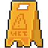

# Attention Sol Mouillé

## AI voice recognition and dungeon crawler

/!\ the ai part isn't fully train, therefore the key support for movement is still up /!\

> AI project done alongside the poc AI pool
> In colaboration with :
> - [Yohann Mangenot](https://github.com/YohannMgt)
> - [Mathieu Borel](https://github.com/mat0904)
----

   
&emsp;&emsp;&emsp;&emsp;&emsp;&emsp;&emsp;&emsp;&emsp;

 
